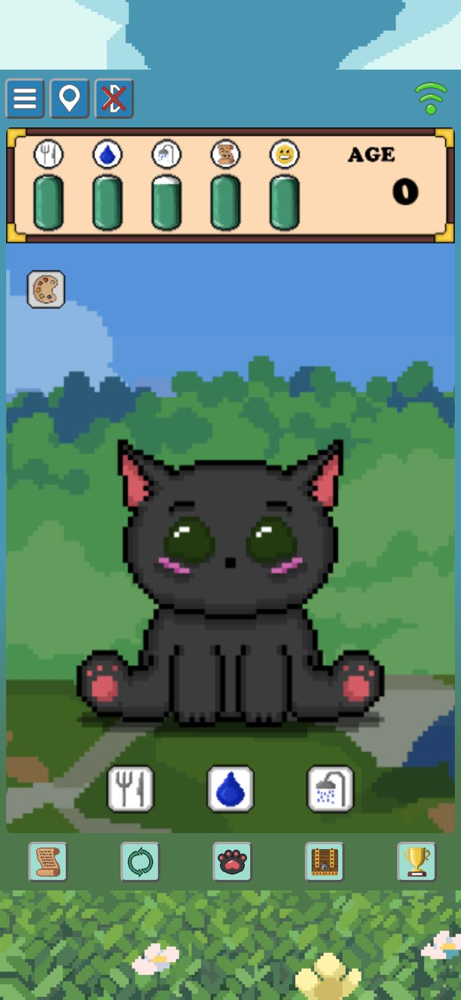
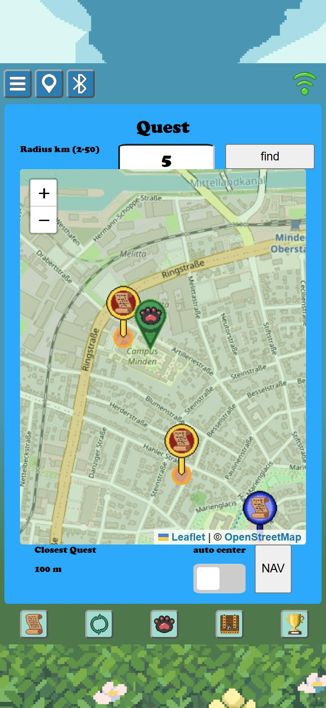
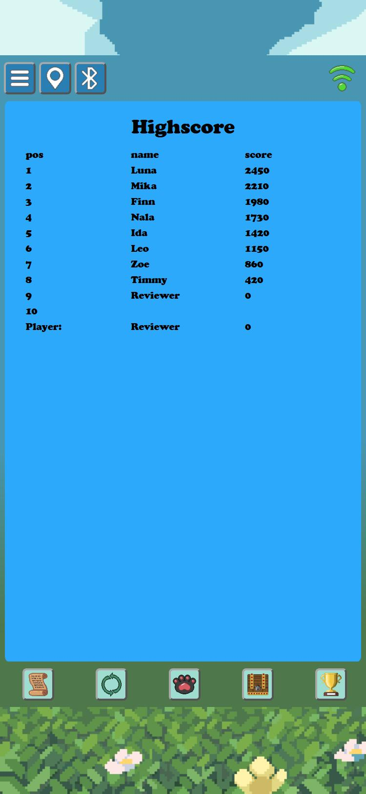
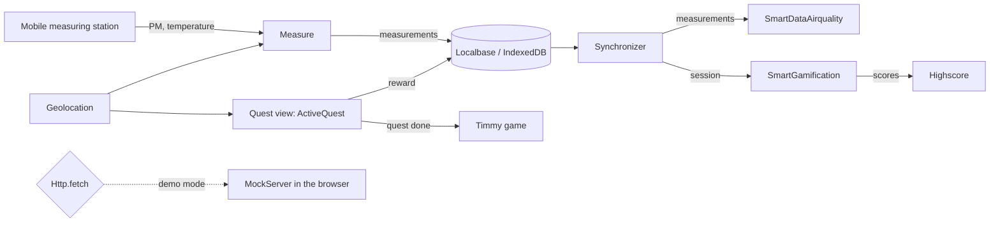

# Timmygotchi

[](https://github.com/WilliReich/timmygotchi/actions/workflows/ci.yml)
[](LICENSE)

A Tamagotchi-style progressive web app that turns mobile air-quality measurements into quests.
Timmy the cat needs food, water, a clean home and finished quests. To finish a quest, the player
walks to a measurement position with a mobile particulate-matter sensor and takes a measurement
there. The collected data goes to a research backend, the player earns points and cosmetic items.

**Try it:** [willireich.github.io/timmygotchi/?demo=1](https://willireich.github.io/timmygotchi/?demo=1),
no backend and no sensor needed, see [Demo mode](#demo-mode).

| Game | Quest map | Highscore |
|---|---|---|
|  |  |  |

## Background

Timmygotchi is the client of my bachelor thesis *Konzeption und Implementierung von Mikro-Services im
SmartEnviroSystem für die Gamifizierung von Luftqualitätsmessungen mit mobilen Messstationen* (2024):
design and implementation of micro services in an existing research system, so that air-quality
measurements with mobile measuring stations become a game.

The thesis had a three-month time frame. In that time the work covered the whole chain:

- **Analysis and design**: stakeholders, user stories, data structures, REST contracts, sequence and
  data-flow diagrams, UI mockups.
- **AirqualityMeasurementPosEditor**, a plugin for the SWAC web framework used by the research
  system. Data administrators place measurement positions on a map and set measuring times per
  weekday. Bilingual UI, input validation, its own PostgreSQL table, data access through the
  framework's model layer.
- **SmartGamification**, a Jakarta EE micro service in Java 17 on Payara with PostgreSQL: players,
  sessions and scores behind a REST API with configurable table names.
- **Framework extensions**: the shared data access layer gained write operations, and the
  SmartDataLyzer service gained endpoints that compute the distance (Haversine) and the climbed
  altitude of a session.
- **Timmygotchi**, this client, written from scratch as a PWA without a framework, because the
  thesis asked for as few libraries as possible on the phone.
- **Hardware**: integration of the mobile measuring station, a Raspberry Pi based device with a
  particulate-matter sensor, reached over its own WLAN hotspot.
- **The written thesis** itself.

Only the client lives in this repository. The plugin, the micro service and the framework extensions
went into the research system's own repositories, which are not public. The initial commit here is
the exact state at submission; everything after it is listed under *What changed since the thesis*.

## How the game works

1. **Timmy** lives on a canvas. Four needs drain over hours: food, water, cleanliness and quests.
   Three of them are refilled with a tap. The quest need is only refilled outdoors.
2. **Quests** are measurement positions from the backend, shown as markers on a map. The player
   connects the mobile measuring station, starts a measurement and walks to a marker. Staying 40
   seconds inside a 30 metre radius completes the quest. If a measuring time is scheduled for that
   position right now, it counts as a bonus quest.
3. **Rewards** unlock random cosmetic items: backgrounds, hats and bodies for Timmy.
4. **Sync** uploads the measurements collected offline and reports the session to the gamification
   service, which scores it. The **Highscore** view shows the top ten players.

## Demo mode

Append `?demo=1` to the URL and the whole system runs inside the browser:

- A fake server answers the routes of SmartGamification, SmartDataAirquality and the measuring
  station with the same JSON contract as the real services. Its state survives reloads.
- Quest positions are generated around your location, or around a fallback position if the browser
  denies geolocation. The closest one is a bonus quest.
- A simulated GPS position walks to the closest quest at 10 m/s after you press *find*, waits for the
  countdown and walks back. Without real geolocation it stays at the quest.
- The quest countdown is 5 seconds instead of 40, and Timmy's needs drain within minutes instead of
  hours, so a reviewer sees his mood change and feeding take effect.
- Demo data lives in separate databases. `?demo=reset` wipes everything and starts over.

Walkthrough: create a player with any name, press *Start Game*, open the sensor view and connect
with any address, press *Start*, open the quest view and press *find*. Then visit Rewards, Sync and
Highscore.

## Getting started

Requires Node.js 20 or newer. The app itself has no build step; Node only serves and tests it.

```bash
npm install
npm start
```

Open <http://localhost:8080/?demo=1>. The server runs without caching, so edits show up on reload.

```bash
npm test        # Vitest, 27 tests
npm run lint    # ESLint
```

Running against a real SmartEnviroSystem needs its base URL via `?api=https://your-server` and a
measuring station reachable under the address entered in the sensor view.

## Architecture

```
index.html, index.js      entry point, registers the service worker, starts the GUI
GUI.js                    menu buttons, switches between views
views/                    one folder per screen: HTML template + a class extending View
  view.js                 base class with the lifecycle init, show, close, update, resize
  Quest/                  map with quest markers (QuestMap), quest completion (ActiveQuest)
  Sensor/                 connection to the measuring station, measurement loop (Measure)
  Sync/                   upload of measurements and sessions (Synchronizer)
game/                     the Tamagotchi: fixed-timestep loop, sprite atlas, layers for
                          background, Timmy and the HUD, needs logic, canvas input
utilities/                settings, local database (Localbase), map helpers, toast, config
utilities/connections/    REST client (api.js), device access (device.js), Http wrapper
utilities/connections/mock/   demo mode: fake server, simulated GPS, geo helpers
serviceWorker.js          precache with a versioned cache name, network first, offline fallback
tests/                    Vitest unit tests
```

Views are HTML templates fetched at runtime and injected into one container; the GUI calls their
lifecycle methods. Modules talk through shared utilities and the local database. ActiveQuest is an
EventTarget, which is how the demo walker learns about targets and finished quests without the
quest logic knowing about the demo.



All HTTP traffic goes through `Http.fetch`. In demo mode it delegates to the in-browser fake
server; in normal mode it is `window.fetch`.

## Tech stack

Vanilla JavaScript with ES modules and private class fields, HTML5 Canvas, Service Worker and Web
App Manifest, Geolocation API, IndexedDB via Localbase, Leaflet with OpenStreetMap tiles and
Leaflet Routing Machine, Vitest, ESLint, GitHub Actions.

## Deployment

The app is static. Copy the repository to any web server, or serve the `main` branch root with
GitHub Pages. Bump `CACHE_NAME` in `serviceWorker.js` with every release, so installed apps pick up
the new file list. Pages are served over HTTPS, which the Geolocation API requires.

## What changed since the thesis

The initial commit is the state of the thesis submission. Everything after it was done in 2026
while preparing the project for this portfolio:

- Dev tooling: npm scripts, ESLint, EditorConfig, pinned CDN dependencies with integrity hashes.
- Demo mode with an in-browser fake server and a simulated GPS walker, so the app can be tried
  without the research backend and the sensor hardware.
- Bug fixes, one commit each: the player marker only moved when the map was centred; bonus
  detection returned from a forEach callback instead of the method; bonus and normal counters were
  swapped; quest counters were lost on a field-name mismatch; a delete with an undefined id wiped
  all stored measurements; the service worker never delivered updates; a crash on a non-existent
  field; a race between connecting the sensor and reading its MAC; markers reported as loaded
  before they existed; `innerHTML` with server data; a string comparison in the age cap; the
  arrival time not reset between quests.
- Refactorings: highscore table filled by a loop, toast messages instead of alert dialogs,
  table-driven HUD buttons.
- Tests with Vitest for the needs logic, the geo helpers, the demo walker and the quest logic, and
  a CI workflow that runs lint and tests on every push.

## Known limitations

- No authentication or protection against manipulated data; the thesis left security out of scope.
- Sync after stopping the measurement. Syncing while it runs uploads the current route and creates
  a second session for it on the next sync, and a record written during the upload can be
  deleted without being uploaded.
- Leaflet and Localbase are loaded from a CDN, so the map views need a network connection even
  though the app shell works offline.
- The sensor protocol is specific to the measuring station of the SmartEnviroSystem.

## Credits

Icons, Timmy, the HUD and the UI graphics were drawn by me. The page background and the in-game
backgrounds are excerpts of third-party images. I believe they were free to use, but I can no
longer trace their source, so I cannot credit the artists properly. If you recognise them,
please open an issue so I can add the credit or replace the images.

## License

[MIT](LICENSE) for the code and the graphics drawn by me. The third-party background images are
excluded.
